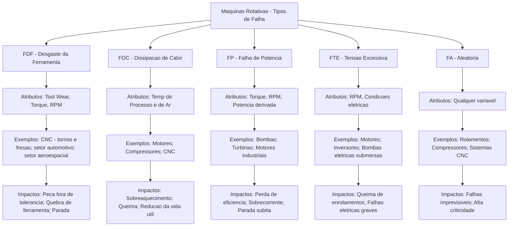

# Tipos de Falhas e Exemplos Industriais

> Com base no exemplo dos atributos do dataset fornecido, são consideradas cinco classes principais de falhas em máquinas rotativas industriais.  
> Abaixo estão exemplos de como cada tipo de falha ocorre em cenários reais, relacionando os atributos coletados (torque, velocidade, temperaturas, desgaste e condições ambientais) às aplicações práticas.

Código | Descrição do tipo de falha industrial | Atributos Relacionados           | Exemplos de Aplicação Real                      | Impacto Industrial
------ | ------------------------------------- | -------------------------------- | ------------------------------------------------ | -------------------------------------------------
**FDF** | Desgaste da Ferramenta               | Tool Wear, Torque, RPM           | Usinagem CNC, indústria automotiva, aeronáutica | Peças fora de tolerância, quebra de ferramentas
**FDC** | Dissipação de Calor                  | Temperatura do processo e do ar  | Motores, compressores, usinagem CNC             | Sobreaquecimento, redução da vida útil, queima
**FP**  | Potência                             | Torque, RPM, Potência            | Bombas, turbinas, motores industriais           | Perda de eficiência, sobrecorrente, parada súbita
**FTE** | Tensão Excessiva                     | Torque, RPM, condições elétricas | Motores, inversores, bombas elétricas submersas | Queima de enrolamentos, falhas elétricas graves
**FA**  | Aleatória                            | Qualquer variável                | Rolamentos, compressores, sistemas CNC          | Falhas imprevisíveis, alta criticidade

