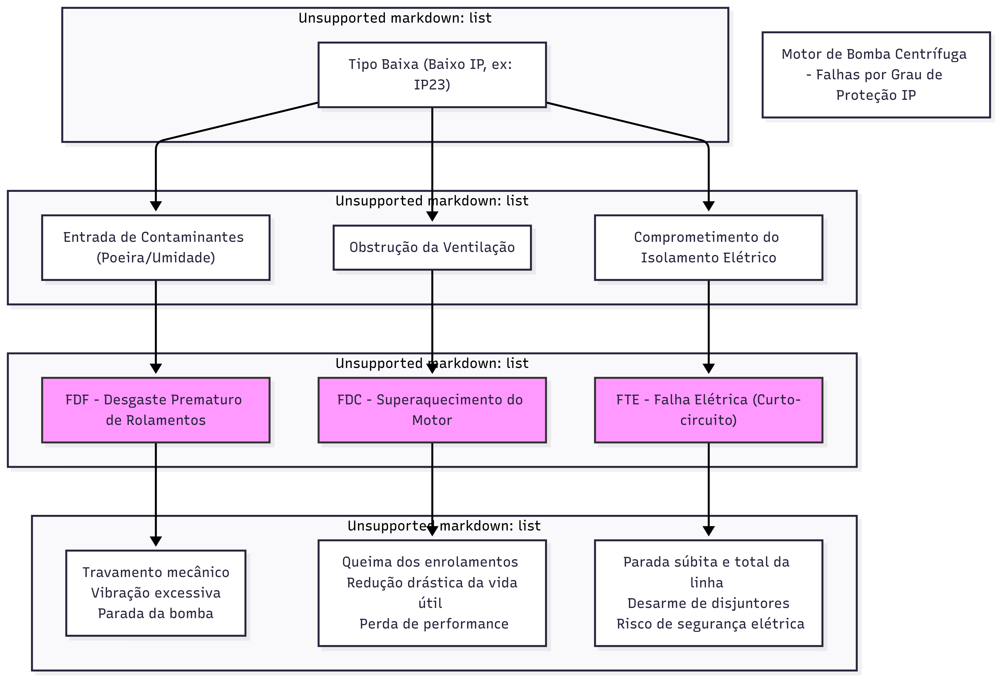

# A classificação por Grau de Proteção (IP) para Motores Elétricos de uma Bomba Centrífuga Industrial.

A justificativa é que, neste cenário, o **Grau de Proteção (IP)** deixa de ser um detalhe técnico e se torna o **fator crítico de sobrevivência do motor**, cria uma conexão direta entre a robustez do motor e sua vulnerabilidade ao ambiente industrial, o que explica perfeitamente a disparidade nas taxas de falha observadas nos dados.

## Motivos

- **Ambiente Inerentemente Agressivo:** Aplicações de bombeamento quase sempre envolvem a presença de líquidos. Seja por respingos, vazamentos nos selos, condensação ou necessidade de lavagem da área, o motor está constantemente exposto à umidade. Este é o ambiente exato onde a diferença entre um motor bem vedado e um motor aberto se torna mais evidente.

- **Plausibilidade no Chão de Fábrica:** É um cenário industrial muito realista encontrar motores de diferentes idades e especificações realizando a mesma função. Uma instalação mais antiga pode ter um motor IP23 que falha cronicamente, enquanto uma instalação mais nova ou uma manutenção bem executada já teria instalado um motor IP55 para a mesma bomba, resultando em maior confiabilidade.

---

## Classificações Grau de Proteção (IP) Utilizada

- **Proteção Alta: IP55**
**Descrição:** Protegido contra poeira e contra jatos d'água.
**Comentário:** Este é o padrão para motores industriais modernos e robustos (Totalmente Fechado com Ventilação - TEFC). A carcaça é selada, impedindo a entrada de poeira e umidade que poderiam contaminar os rolamentos e causar curtos-circuitos. Sua alta proteção justifica a baixíssima taxa de falha observada nos dados, pois é o motor mais resiliente ao ambiente de fábrica.Um motor IP55 (totalmente fechado) é projetado especificamente para resistir a este ambiente. Sua carcaça selada protege os componentes internos de jatos d'água e poeira, garantindo uma operação confiável. Isso justifica sua baixíssima taxa de falha.

- **Proteção Média: IP44**
**Descrição:** Protegido contra corpos sólidos maiores que 1 mm e contra projeções de água.
**Comentário:** Representa um motor com um nível de proteção intermediário. Ele é protegido contra a entrada de ferramentas ou fios e resiste a respingos d'água, mas não é totalmente vedado contra a poeira fina. Essa vulnerabilidade parcial explica por que ele falha mais que o tipo Alta, mas ainda é consideravelmente mais confiável que o Baixa.

- **Proteção Baixa: IP23**
**Descrição:** Protegido contra corpos sólidos maiores que 12,5 mm e contra borrifos d'água.
**Comentário:** Este é um motor de construção "aberta", com fendas de ventilação que permitem a livre circulação do ar. Embora isso ajude na refrigeração, o torna extremamente vulnerável a contaminantes do chão de fábrica. A entrada de poeira, cavacos metálicos ou névoa de óleo/refrigerante pode facilmente:
    - Obstruir as passagens de ar, causando superaquecimento (FDC).
    - Contaminar o isolamento dos enrolamentos, levando a falhas elétricas (FTE).
    - Abrasar os rolamentos, causando desgaste prematuro (FDF).

---

## Diagrama Mermeid: Falhas Grau de Proteção Tipo Baixa (IP23)

